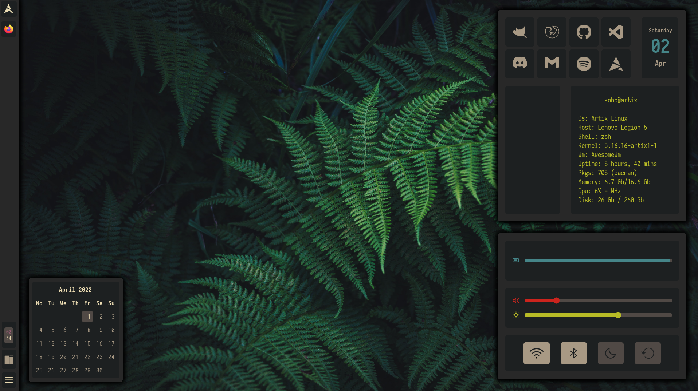
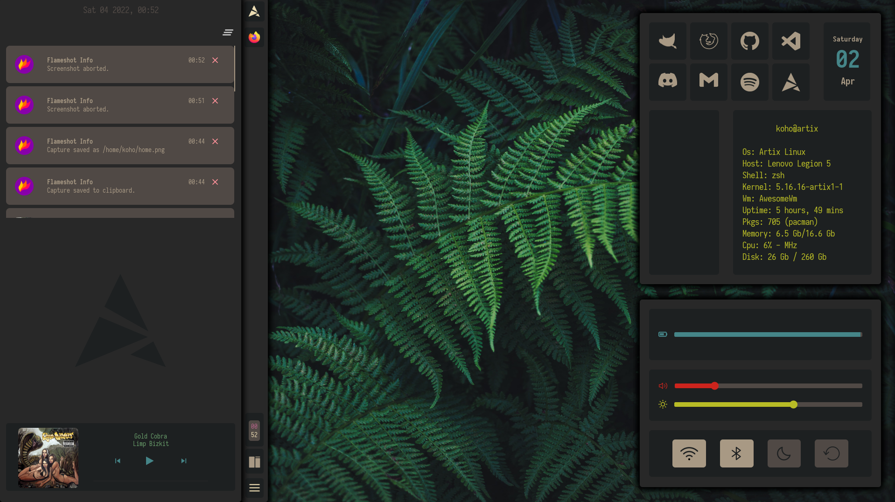

# WARNING - Work in Progress
## My Configuration files 
  - [General Info](#general-info)
  - [My Setup](#my-setup)
  - [Dependencies](#dependencies)
  - [Installation](#installation)
    - [Download listed dependencies](#download-listed-dependencies)
    - [Begin Installation](#begin-installation)
  - [Configuration](#configuration)
    - [Colors](#colors)
    - [Icons](#icons)
    - [Font](#font)
    - [Applications](#applications)
  - [Notes](#notes)
    - [Thanks to](#thanks-to)
## General Info
*   These are config files for the softwares I use. Might not be suitable for your use. Still under work, as you can see. There are also lot of quite hacky things that need to be fixed, so be prepared.

## My Setup


* Os: Artix Linux(openrc)
* Wm: AwesomeWM
* Shell: zsh
* Terminal: Alacritty/Wezterm
* Compositor: picom
* App Launcher: rofi
* Editor: vscode/neovim

## Dependencies
* Arch based distro
* Packages:
```shell
# From standard repos
sudo pacman -S playerctl brightnessctl wezterm rofi flameshot lua53 luarocks pulseaudio
```
```shell
# Change AUR-helper if needed
yay -Sy picom-ibwaghan-git awesome-git inotify-tools alsa-utils alsa-tools wireless_tools jq checkupdates brave-bin nerd-font-complete --needed
```

## Installation
### Download listed dependencies
* See [Dependencies](#dependencies)
### Begin Installation
* Clone this repository
```shell
git clone https://github.com/K9H9/Config $HOME/awesome-config
```
* Before continuing make backups of your own configs, they are coing to be overridden
* i.e awesome
```shell
mv $HOME/.config/awesome $HOME/.config/awesome-old
```
* Copy new configuration files from cloned repo
```shell
cp -r $HOME/awesome-config/.config/awesome $HOME/.config/awesome
cp -r $HOME/awesome-config/.Xresources $HOME/
```
* And optionally other applications
```shell
cp -r $HOME/awesome-config/.config/wezterm $HOME/.config/wezterm
cp -r $HOME/awesome-config/.config/gtk-3.0 $HOME/.config/gtk-3.0
cp -r $HOME/awesome-config/.config/picom $HOME/.config/picom
cp -r $HOME/awesome-config/.config/rofi $HOME/.config/rofi
```
## Configuration
* You possibly need to change some shell commands in config (most of them in `~/.config/awesome/ui/bar/`), since I use Artix and they are not suitable for most of the other distros. 
### Colors
  * Most of the colors are loaded from .Xresources and they can be changed there. Their assigned names and some of the colors can be changed in ```~/.config/awesome/theme/theme.lua```
### Icons 
  * Icons can be changed in  ```~/.config/awesome/theme/theme.lua```  too. Just download your icon(svg recommended for recolorization) and place it to ```~/.config/awesome/icons/```. Lastly make theme entry for it.  ```theme.my_icon = gfs.get.configuration_dir() .. "icons/my_icon.svg"``` so you can reference it in the config files as ```beautiful.my_icon ```
### Font
  * Font is set in ```~/.config/awesome/theme/theme.lua```
### Applications
  * You can change preferred applications in ```rc.lua```

## Notes
### Thanks to
* [nuxshed](https://github.com/nuxshed/dotfiles)
* [rxyhn](https://github.com/rxyhn)
* [JavaCafe01](https://github.com/JavaCafe01)


